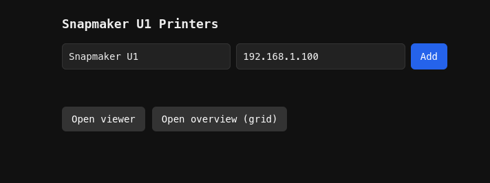
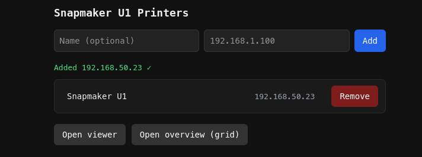
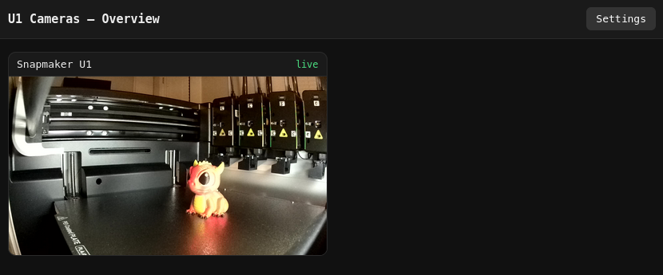
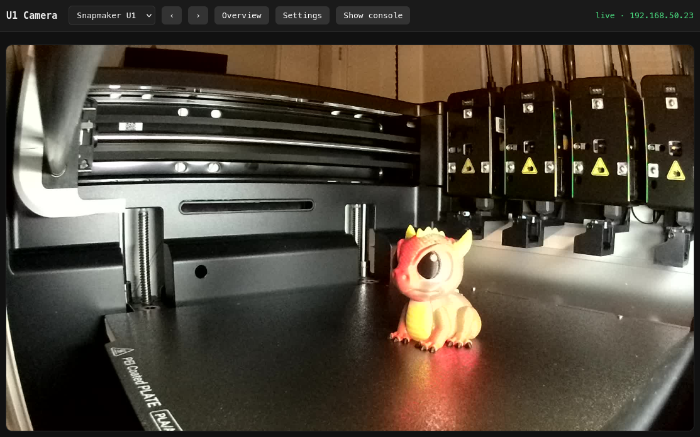
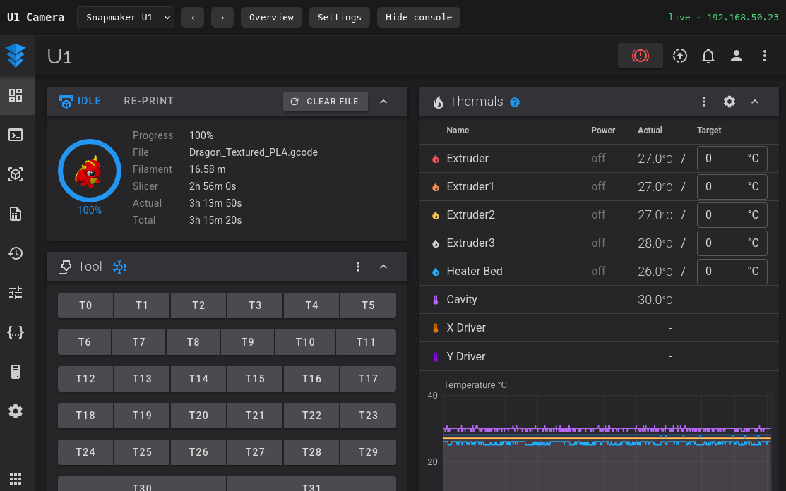

# Snapmaker Camera Viewer
#### A Firefox addon that gives you a dashboard to manage your Snapmaker U1 printers

## About
This project is a simple addon which allows you to view the cameras on your Snapmaker U1 printers. You can set the IPs of each printer and view them all from a single interface. You can also view the native webview of each printer directly!

> Note: I only have a single printer, so I have not been able to test a multi-printer setup. It works in theory, but YMMV.

I made this in a single afternoon because I didn't want to install some 3rd party firmware just to see the camera.

## Features
- Live* view of the camera!
  - *Updates every 15 seconds
- View printer's webview UI directly!
- Manage multiple printers!*
  - *Theoretically
- Works on stock firmware!

## Roadmap
> Note: I'll work on this as I need these changes, so timeline is unknown
- Refactor to containerize the U1 and permit working with other printers
- Configurations for things like refresh frequency, overview grid size, etc

---

## Installation
You should be able to install from the Firefox store.

--- Pending Review ---

## Setup and Use
To open the dashboard interface, click on the extension icon. For your first-time, you will be presented with the Settings page where you can add your printers.

On this page, enter the name for your printer and its IP address. Click 'Add'.

Once added, the printer will show in the list. Add as many printers as you need. Once ready, you can open the Overview page by clicking on "Open Overview".

This will take you to a grid-view of your printers and a live image from each camera will show in the frame. Each card can be clicked to open a large view of the camera.

From this view, you can see a full size image of the printer as well as some options at the top. The dropdown will let you go to another printer in the list. The left and right arrows will cycle between printers in order. The Overview button returns you back to the grid view. Settings will take you back to the settings page to add additional printers. And finally a Show Console button which will bring up a new view.

This opens the native Snapmaker UI webview which allows you to control everything you normally would from the webview directly.

